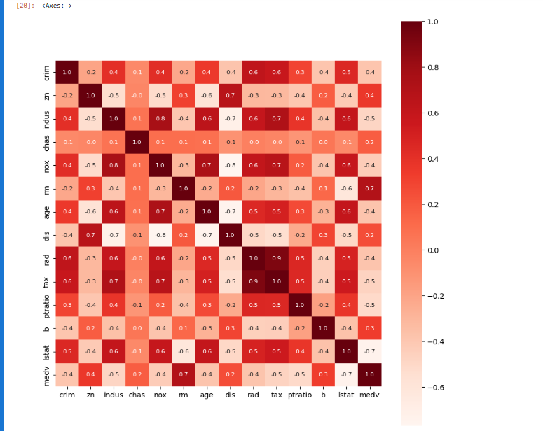
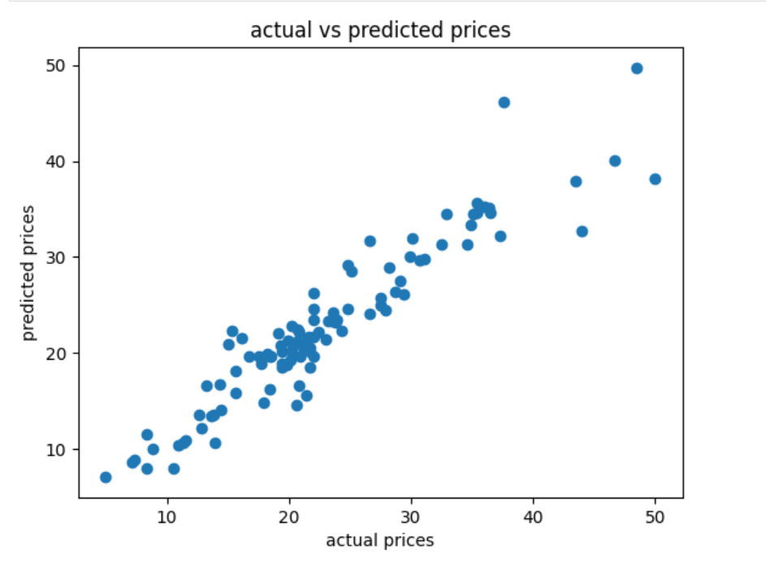

# 🏠 Boston House Price Prediction (XGBoost)

A machine learning project that predicts median house prices in Boston suburbs using an **XGBoost Regressor**, trained on the classic Boston Housing dataset. This repository covers the full pipeline — data preprocessing, exploratory data analysis, model training, evaluation, and prediction.

## 📌 Project Overview

The goal of this project is to predict the median value of owner-occupied homes (`MEDV`) in Boston suburbs using features such as crime rate, number of rooms, pupil-teacher ratio, and accessibility to highways — using **XGBoost**, a gradient-boosted decision tree algorithm known for strong performance on tabular data.

## 📂 Dataset

- **Source:** [Boston Housing Dataset](https://www.kaggle.com/datasets/altavish/boston-housing-dataset)
- **Rows:** 506
- **Features:** 13 input features + 1 target variable (`MEDV`)

| Feature | Description |
|---------|-------------|
| CRIM | Per capita crime rate by town |
| ZN | Proportion of residential land zoned for large lots |
| INDUS | Proportion of non-retail business acres per town |
| CHAS | Charles River dummy variable (1 if tract bounds river, else 0) |
| NOX | Nitric oxide concentration (parts per 10 million) |
| RM | Average number of rooms per dwelling |
| AGE | Proportion of owner-occupied units built before 1940 |
| DIS | Weighted distance to employment centers |
| RAD | Index of accessibility to radial highways |
| TAX | Property tax rate per $10,000 |
| PTRATIO | Pupil-teacher ratio by town |
| B | Proportion of Black residents by town |
| LSTAT | % lower status of the population |
| MEDV | Median value of owner-occupied homes in $1000s (**target**) |

> ⚠️ **Note:** This dataset includes a feature (`B`) derived from racial demographics and has been deprecated from `scikit-learn` due to ethical concerns. It is used here purely for educational/portfolio purposes.

## 📊 Exploratory Data Analysis

**Correlation Heatmap**



**Actual vs Predicted Prices**



## 🛠️ Tech Stack

- **Language:** Python 3.x
- **Libraries:** pandas, NumPy, scikit-learn, xgboost, matplotlib, seaborn
- **Environment:** Jupyter Notebook

## 🔍 Project Workflow

1. **Data Preprocessing** – Handling missing values, checking for outliers
2. **Exploratory Data Analysis (EDA)** – Correlation heatmap, distribution plots, feature relationships with `MEDV`
3. **Feature Scaling** – Standardizing features where applicable
4. **Train-Test Split** – Splitting data for unbiased evaluation
5. **Model Training** – Fitting an `XGBRegressor` on the training data
6. **Hyperparameter Tuning** – GridSearchCV / RandomizedSearchCV over parameters such as `n_estimators`, `max_depth`, `learning_rate`, `subsample`
7. **Model Evaluation** – Assessing performance using RMSE and MAE
8. **Visualization** – Plotting actual vs predicted prices to inspect fit quality

## 📊 Results

| Metric | Score |
|--------|-------|
| RMSE | 0.887 |
| MAE | 2.148 |

## 📈 Key Insights

- [e.g., `RM` and `LSTAT` were the most important features according to XGBoost's feature importance scores]
- [e.g., the scatter plot shows predictions tracking closely with actual prices, with more spread at higher price points]
- [Add insights specific to your EDA/results]

## 🚀 How to Run This Project

1. Clone the repository
   ```bash
   git clone https://github.com/anshikagandhi03-star/house-price-prediction-model.git
   cd house-price-prediction-model
   ```

2. Create a virtual environment (optional but recommended)
   ```bash
   python -m venv venv
   source venv/bin/activate   # On Windows: venv\Scripts\activate
   ```

3. Install dependencies
   ```bash
   pip install pandas numpy scikit-learn xgboost matplotlib seaborn jupyter
   ```

4. Run the notebook
   ```bash
   jupyter notebook house_price_prediction_using_XGBoost.ipynb
   ```

## 📁 Repository Structure

```
house-price-prediction-model/
│
├── BostonHousing.csv
├── house_price_prediction_using_XGBoost.ipynb
├── heatmap.png
├── scatter_plot.png
└── README.md
```

## 🔮 Future Improvements

- Deploy the model as a web app using Streamlit or Flask
- Add SHAP values for model interpretability
- Compare XGBoost against other ensemble methods (Random Forest, LightGBM)
- Perform k-fold cross-validation for more robust evaluation

## 🙋‍♀️ About Me

I'm a student building toward a career at the intersection of machine learning and finance, currently working on projects to strengthen my portfolio for data science and fintech internships.

**Anshika Gandhi** — BIT Mesra, ECE

- **GitHub:** [anshikagandhi03-star](https://github.com/anshikagandhi03-star)

## 📄 License

This project is created for educational and learning purposes. Feel free to fork, modify, and improve it with proper attribution.

---

⭐ If you found this project helpful, consider giving it a star!
